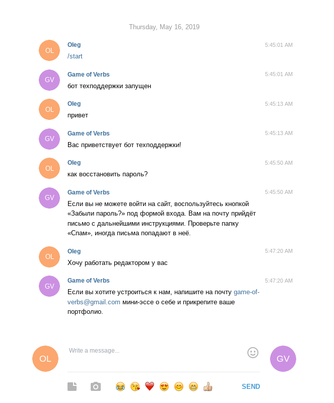
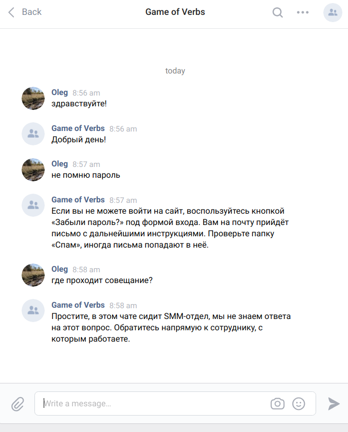

# Support Bot

This bot can help support service with routine work. Actually, there are two bots  - Telegram Bot and VKontakte Bot. Both bots use [Dialog Flow](https://dialogflow.com/) platform, based on [NLP - technology](https://en.wikipedia.org/wiki/Natural_language_processing).

## How to install

1. Python 3.6 and libraries from **requirements.txt** should be installed.

```bash
$ pip install -r requirements.txt
```

2. Create new Telegram bot, get token and your ID.

3. Create project in the Dialog Flow and get two API tokens.

4. Create new VK group (or use exists), get API token of the group and alow the group to write messages.

5. Put all necessary parameters to .env file.

```
TOKEN_TG=telegram_token
CHAT_ID_TG_ADMIN=telegram_chat_id_admin
TOKEN_DF=token_dialog_flow
TOKEN_DF_DEV=token_dialog_flow_development
TOKEN_VK=token_vkontakte

```
and replace in files **main_tg.py** and **main_vk.py** lines looks like:

```python
VAR = os.environ['VAR']
```

with

```python
VAR = os.getenv('VAR')
```

6. Add new intents to your Dialog Flow project from **question.json**. The **intents.py** script can helps you with it.


## Quickstart

Run both **main_tg.py** and **main_vk.py** files and test it with questions from your Dialog Flow project intents.

```bash
$ python main_tg.py
```




```bash
$ python main_vk.py
```



## How to deploy

For example, you can deploy apps on [Heroku](https://heroku.com), with
GitHub integration.

1. Create two apps on Heroku with GitHub deployment method. Do not forget
about **requirements.txt** and **Procfile** which, obviously will be different for every app. , although Git repository can be only one.  Don't enable automatic deploy if you use one repository for two apps. For real project it's better to separate bots.

Replace in files **main_tg.py** and **main_vk.py** lines looks like:

 ```python
VAR = os.getenv('VAR')
 ```

 with

 ```python
 VAR = os.environ['VAR']
  ```

2. Add necessary environment variables to Settings > Config Vars section of every app.

3. Activate your Dyno in the "Resourses" section.

For reading logs install [Heroku CLI](https://devcenter.heroku.com/articles/heroku-cli#download-and-install) and log in.

```bash
$ heroku logs -a your-app-name
```

Of course, you can create and manage your apps directly from the Heroku CLI.


## Project Goals

The code is written for educational purposes on online-course for
web-developers [dvmn.org](https://dvmn.org/).
